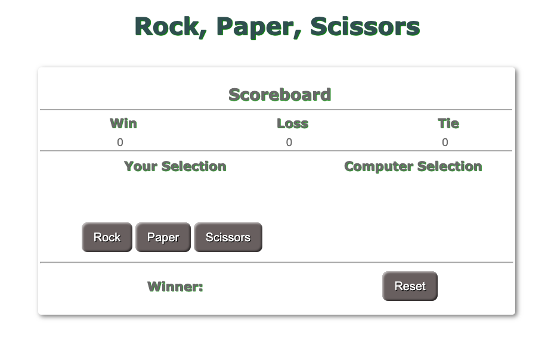
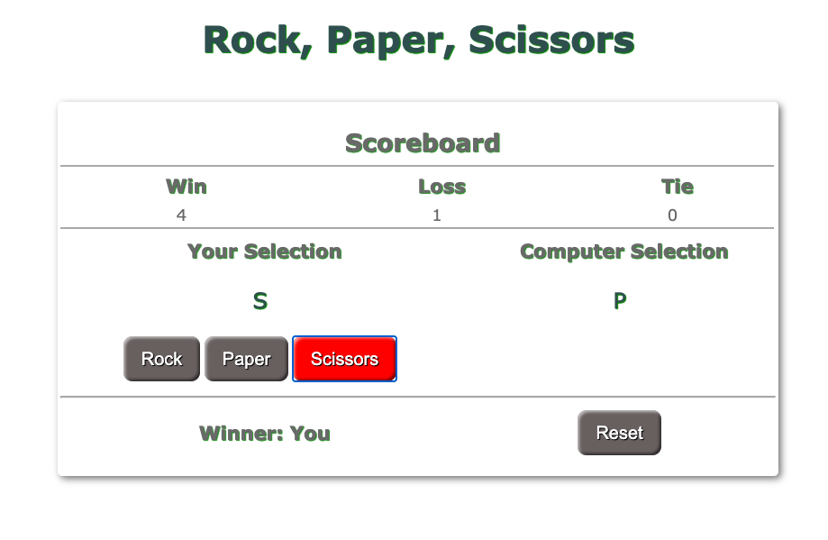

# wk3-rock-paper-scissors
Rock, paper, scissors game using Javascript/HTML/CSS. This game is played by you agaist the computer. A scroboard shows current score and at the bottom it shows who is current winner. Reset button resets all score and winner.

## Getting Started
Code: [Code](https://github.com/manzur-shaheed/wk3-rock-paper-scissors)
Live: [github pages](https://manzur-shaheed.github.io/wk3-rock-paper-scissors/)

You can clone code from [github link](https://github.com/manzur-shaheed/wk3-rock-paper-scissors) and run it locally on your computer.

### Prerequisites

A computer with browser that supports javascript. To clone code from github, you need to have aceess to Internet. Also your computer should have Terminal (Unix) software installed. For Windows users, you can get it from https://www.cygwin.com/. For Mac users, it comes pre-installed with MacOS. 

### Installing

- Open a terminal.  
- Create a directory for this project.
- Change current directory to this project direcory.
- Issue the following command -

```
git clone git@github.com:manzur-shaheed/wk3-rock-paper-scissors.git
```
You can then run this tool by opening index.html page from this directory in a browser.

## Deployment

- Initial window 


Once you start clicking on ```Rock``` or ```Paper``` or ```Scissors```, computer will generate a random selection from one of these three choices and then compare against your choice and then make the decision on winner. Current score is shown in the scoreboard and current winner is shown in botton left of the main screen.



if you click on ```Reset``` Scoreboard is reset and Winner is set to blank.

## Built With

* [HTML](https://developer.mozilla.org/en-US/docs/Web/HTML)
* [Javascript](https://developer.mozilla.org/en-US/docs/Web/JavaScript)

## Acknowledgments
* **Billie Thompson** - [PurpleBooth](https://github.com/PurpleBooth) for the README Template.